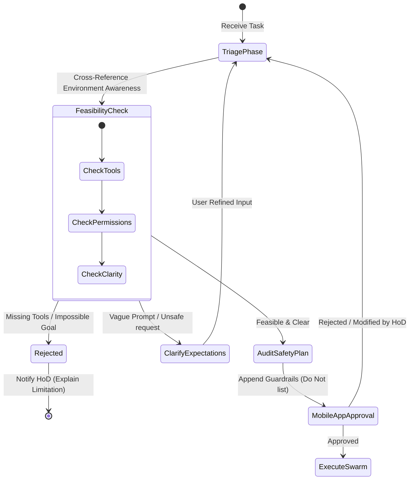

# AI IT Team Architecture Notes

This document outlines the simplified, non-technical architecture, workflows, and responsibilities for the **AI IT Team Command Center** designed for Heads of Departments (HoDs). It runs on local M4 Mac Minis and is controlled via a custom cloud-hosted mobile app.

---

## 1. System Architecture Diagram

```mermaid
graph TD
    %% Custom Mobile App Front-End on Railway
    subgraph Railway Cloud (Public Internet)
        MobileDashboard[Custom Mobile App UI / Command Center]
        MailboxAPI[Mailbox Coordinator & DB]
    end

    %% Outbound WebSocket Connection (Tunnel Bypass)
    CommCenter[Command Center Agent: Python Client] -- Outbound WebSocket Client Connection --> MailboxAPI

    %% Local PC Environment (M4 Mac Mini on Residential ISP)
    subgraph Local M4 Mac Mini
        CommCenter <--> LocalStorage[(Local PC Storage & Repos)]
        CommCenter <--> CodingAgent[Coding Agent: Claude]
        CommCenter <--> TesterAgent[Tester Agent: local Playwright]
        CommCenter <--> LocalSystem[Local System Commands & Compiler]
    end

    %% Swarm Orchestrator with Logical, Logistics, & Guardrail Processing Gates
    subgraph Agent Swarm (Running on Mac Mini)
        CommCenter <--> LogicalProcessor[Logical Processing Engine]
        LogicalProcessor <--> Guardrail[Guardrail Agent]
        LogicalProcessor <--> Quartermaster[Quartermaster Agent]
        Quartermaster <--> SwarmManager[Swarm Manager]
        SwarmManager -- Spawns --> CodingAgent
        SwarmManager -- Spawns --> TesterAgent
    end
    
    %% Staging deploy loop
    TesterAgent -- Deploys Staging --> StagingLink[Staging Web Preview]
    MobileDashboard -- Click to Preview --> StagingLink
```

---

## 2. Supporting Multiple Department HoDs (Local PC Isolation)

Under this model, **each department HoD runs a local instance of Hermes-Agent on their own M4 Mac Mini**:
*   **On-Device Autonomy**: The agent runs directly on the HoD's M4 Mac Mini, giving it direct access to local files, codebases, and compiler/system tools.
*   **Department Profile**: Each Mac Mini is configured with a profile matching that department's specific configurations (API keys, repository paths, and long-term memory of department preferences).

---

## 3. The Environment Awareness System (Capabilities & Boundaries)

To prevent the agent swarm from hallucinating tools or executing invalid operations, the local M4 Mac Mini maintains a structured **Environment Awareness Document** (`environment_awareness.yaml`) that acts as the single source of truth for capabilities and limits.

### A. Document Schema & Catalog
*   **AI Model Capabilities**: Connectable LLMs, token limits, and reasoning capability tags (e.g. `sonnet-3.5`, `deepseek-r1`).
*   **API Keys & Accounts**: Status of credentials (e.g. GitHub OAuth token, Railway deploy tokens, OpenAI/Anthropic keys).
*   **Local System CLIs**: Executable paths and verification flags for system tools (`git`, `node`, `playwright`, `railway-cli`, `claude-code`).
*   **MCP (Model Context Protocol) Servers**: Active local MCP integrations (e.g., local database access, folder search systems).
*   **Skills Library**: Available custom automation scripts and pre-configured workflows.

---

## 4. The Quartermaster AI (The Logistics Agent)

While other agents focus on code design and testing, the **Quartermaster AI** acts as the system logistics manager. It is responsible for setting up the environment, checking resources, and maintaining tools.

### A. Key Responsibilities
1.  **System Resource Checks**: Verifies local disk space, memory, and permissions to ensure the workstation won't crash or hang during a code compile/build run.
2.  **Tool Preparation**: Installs workspace dependencies (e.g., running `npm install` or `pip install` in the project directory) before the Coder Agent starts writing.
3.  **Authentication Management**: Handles reading API keys and verifying SSH/OAuth access to repositories.
4.  **Executing Smoke Tests**: Runs the actual diagnostic suite (`smoke_test.py`) to generate and update the `environment_awareness.yaml` file.
5.  **Workspace Provisioning**: Creates necessary directories, fetches template structures, and sets up files for a clean build workspace.

---

## 5. The Guardrail Agent (Safety & Negative Constraints)

To prevent catastrophic mistakes (like deleting migrations, rewriting correct directories, or exposing keys), the **Guardrail Agent** acts as a safety auditor during the planning phase.

### A. Key Responsibilities
1.  **Auditing the Plan**: Reviews the drafted task list generated by the Swarm Manager.
2.  **Injecting Negative Constraints**: Appends a mandatory **"Do Not"** checklist containing specific restrictions.
    *   *Examples of Guardrails*:
        *   *"Do not delete database migrations (`/prisma/migrations` or `/migrations`)."*
        *   *"Do not write hardcoded credentials or API keys into source code files."*
        *   *"Do not edit files outside the approved directory path."*
        *   *"Do not push changes directly to the `main` or `production` branch."*
3.  **Gating Code Writing**: Injects these negative constraints directly into the Coding Agent's system context. The coder is strictly forbidden from executing any action that triggers a guardrail constraint.

---

## 6. Custom Mobile Communication App Design (Simplified for Non-Technical HoDs)

HoDs are not programmers and must be shielded from technical outputs like logs, CLI flags, and code diffs.

### A. Communication Protocol (Outbound Security)
*   **The Mobile App talks ONLY to Railway**: The mobile phone never connects to the M4 Mac Mini directly. It sends requests to `command-center.up.railway.app`.
*   **The Mac Mini pushes updates to Railway**: The M4 Mac Mini maintains an outbound WebSocket to Railway, pushing state updates to the cloud database.

### B. Mobile Interface Modules (Thumb-Friendly, Simple)
1.  **Simple Chat Console**: A clean messaging UI showing clear execution steps (e.g., `[Thinking 💭]`, `[Testing 🧪]`).
2.  **Interactive Task Checklist (Kanban Alternative)**: Displays a simple **Task Checklist** (e.g., *"1. Analyze request [Done] · 2. Write code [In Progress] · 3. Verify changes [Pending]"*). It also includes a **"Do Not" Safety section** generated by the Guardrail Agent.
3.  **Human-in-the-Loop Approvals Dialog**: Popups prompting the HoD to approve critical operations: *"Ready to deploy the CRM patch to staging. [Approve Deployment] / [Cancel]"*.
4.  **High-Level Agent Status**: Replaces developer logs with a simple status dashboard (`Main Brain: Active`, `Coder: Sleeping`, `Tester: Idle`).

---

## 7. No-Code Safety & On-Device Automation

The local agent swarm manages all technical tasks securely on the workstation:

1.  **Goal Decomposing**: The Main Brain decomposes the HoD's high-level command into local task items.
2.  **On-Device Coding**: The Coding Agent (Claude) edits files in the local workspace directory.
3.  **Local Testing**: The Tester Agent runs testing tools (Playwright) directly on the local system, checking the project and reporting a simple summary back.
4.  **Automated Railway Deployments (Without Human Intervention)**:
    *   Once the testing phase passes, the DevOps/Tester Agent executes automated deployments programmatically.
    *   **Authentication**: The local M4 Mac Mini profile's `.env` contains the environment variable `RAILWAY_TOKEN` (provided during onboarding).
    *   **Execution Commands (CLI)**:
        *   To link a local workspace to the project: `railway link --project-id <project_id>`
        *   To deploy code directly (bypassing manual Git push loops): `railway up --detach` (pushes the local code folder and initiates the build/deploy in the background).
        *   To configure environment variables: `railway variables set KEY=VALUE`
        *   To poll build status: `railway status --json`
    *   **GraphQL API Integration**:
        *   For complex actions (like spinning up new database containers or deleting stale staging services), the DevOps Agent initiates outbound HTTP GraphQL requests to Railway's backboard API (`https://backboard.railway.app/graphql`).
        *   It executes mutations (e.g. `serviceCreate`, `deploymentRedeploy`, `environmentCreate`) programmatically, checks logs for compilation issues, and handles any build failures automatically without requiring HoD intervention.

---

## 8. Workflow & Logical Gap Solutions

### Gap 1: How does a mobile phone preview websites/code running on a local residential PC?
*   **Solution**: The Tester Agent executes a CLI deploy command, pushing the current build to a temporary **Railway Staging** link. It returns the public link (e.g. `https://marketing-staging.up.railway.app`), rendering a **"Preview Changes"** button on the HoD's phone.

### Gap 2: How does a non-technical HoD set up credentials (GitHub/Railway keys) on the Mac Mini?
*   **Solution**: The Mobile App implements an OAuth sign-in flow (e.g., *"Log in with GitHub"*). Once authenticated, Railway pushes the OAuth tokens down the WebSocket to the local Mac Mini, writing them into the local `.env` configuration file.

### Gap 3: How does the cloud route messages to the correct department's Mac Mini?
*   **Solution**: 
    *   When the local client on a Mac Mini establishes its WebSocket to Railway, it registers with a unique header: `x-department-id: marketing`.
    *   When a Marketing HoD logs into the mobile app, the Railway database tags their session as `marketing` and routes commands to the corresponding socket.

---

## 9. Deployment & Networking (Outbound-Only Connection Model)

### A. Railway Cloud: The Mailbox Server
*   **Role**: Railway hosts both the static frontend UI and a lightweight "Mailbox Coordinator" API backend. It exposes `wss://command-center.up.railway.app/ws` securely over HTTPS/WSS.

### B. M4 Mac Mini: The Outbound Client
*   **Connection**: A background script on the Mac Mini establishes a persistent **outbound WebSocket connection** to the Railway Mailbox. It is unaffected by dynamic IPs, CGNAT, or local firewalls.

### C. How Real-Time "Listening" Works (The WebSocket Loop)
1.  **Establishing the Tunnel**: The M4 Mac Mini connects outward to Railway: `Mac Mini (Outbound) --> Railway Server`.
2.  **Persistent Connection**: They keep this TCP channel open constantly.
3.  **Real-Time Push (Railway -> Mac Mini)**: When the HoD submits a command, Railway pushes it down the active channel. The local Mac Mini receives it in real-time and streams back the responses.
4.  **Auto-Reconnect**: If the dynamic IP changes, the Mac Mini automatically opens a new outbound connection to Railway.

### D. Traffic Flow: What is Shared?
*   **Sent from Railway -> Local Mac Mini (Incoming to PC)**:
    *   **Commands**: Plain text prompts sent by the HoD from their mobile phone (e.g., *"Update CRM integrations"*).
    *   **OAuth Credentials**: Authentication tokens (GitHub, Railway, OpenAI keys) input via the mobile app.
    *   **Approvals**: The HoD's confirmation inputs.

*   **Sent from Local Mac Mini -> Railway (Outgoing to Cloud)**:
    *   **Chat Responses**: Plain text replies generated by Hermes.
    *   **Agent State**: High-level execution status updates for the Checklist (e.g. `status: "running-playwright-tests"`, `status: "compiling-code"`).
    *   **Approval Prompts**: Requests for human approval before critical operations.
    *   **Staging Preview URLs**: Links generated by the DevOps deployment tool.
    *   **Simplified Health Status**: High-level indicator (Online/Offline) of the local agent system.

---

## 10. Cognitive Logic (Feasibility) vs. Environmental Logistics (Quartermaster)

To ensure high reliability, the roles of analyzing a task's feasibility and preparing the environment to execute it are separated.

| Feature / Responsibility | **Logical Processing (Feasibility Gate)** | **Quartermaster AI (Logistics Gate)** |
|:---|:---|:---|
| **Primary Domain** | Logic, safety, and requirement clarity. | System resources, credentials, and tool health. |
| **Action Level** | Cognitive planning (read-only). | Environment mutation (write & test execution). |
| **Tool Assessment** | *Reads* the Environment Awareness file to decide if the task is possible. | *Calculates & tests* tool health to generate the Environment Awareness file. |
| **Tasks & Checklists** | Drafts the *functional success checklist* based on the HoD request. | Prepares the *physical build workspace* (folders, dependencies, config files). |
| **Decision Type** | Reject, Modify, or Approve the user task. | Flag tool configurations as Active/Inactive; execute repairs. |

---

## 11. The Logical Processing Engine (Anti-Overconfidence Gate)

To prevent the agent swarm from blindly rushing to execute impossible, vague, or unsafe tasks, the **Swarm Manager (Main Brain)** executes a mandatory **Triage & Planning Phase** before any code is written.



### A. Phase 1: Feasibility Assessment (vs. Environment Awareness)
Before planning, the Main Brain compares the HoD's request against the **Environment Awareness Document**:
1.  **Capability Mapping**: Does the local Mac Mini have the runtime/compilers required (e.g. Node, Python, Docker)?
2.  **Credential check**: Are the target repository permissions or deployment accounts configured?
3.  **Fast Failure (Active Rejection)**: If a tool is missing or the goal is mathematically/logically impossible, the Main Brain immediately **rejects the task** and reports exactly why (e.g., *"Cannot build iOS App. Xcode is not installed in the Environment Awareness catalog."*).

### B. Phase 2: Expectation Alignment (Clarification Loop)
If the task is feasible but vague, the agent enters a clarification state instead of guessing:
*   **Expectation Tuning**: It prompts the HoD with specific options (e.g., *"You asked to sync contacts. Do you want to sync dynamically in real-time (requires webhook) or run a scheduled sync every 24 hours?"*).
*   **Safety Boundaries**: If a task requests something destructive, it suggests a safer alternative.

### C. Phase 3: Result-Oriented Plan & Checklist Drafting
Once aligned, the Main Brain drafts a **Result-Focused Plan**:
1.  **Execution Steps**: Concrete coding tasks for the Coder Agent.
2.  **Result Success Criteria**: The exact testable outcomes the DevOps/Tester Agent must verify (e.g., *"Staging URL must load without JS errors"*, *"Endpoint `/api/contacts` must yield a 200 status code"*).
3.  **Guardrail Audit (Negative Constraints)**: The **Guardrail Agent** audits this plan and appends a **"Do Not / Safety constraints"** section (e.g. *"Do not touch production database"*, *"Do not hardcode API keys"*).
4.  **HoD Sign-off Gate**: Both the positive Task Checklist and the negative Guardrails are pushed to the HoD's mobile app. The Swarm remains locked in an idle state and **will not execute** until the HoD reviews and taps **"Approve Plan"**.
